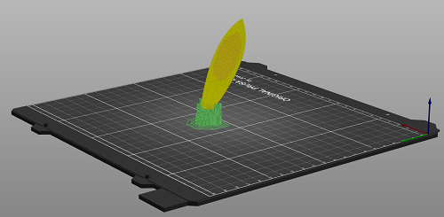
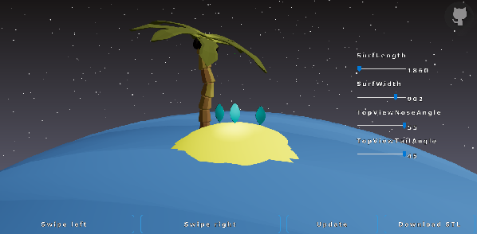

# SurfShaper !

## Purpose of SurfShaper application?
Main goal of this web appliciation is allow user to create and shape his own sufboard. After surfboard is shaped, board could be downloaded in stl format. After that shaped surfboard may be dispatched local CNC master who can made this surfboard of styrofoam.

## How does app work?
Application uses Onshape cloud based `CAD software`, where parametric model is configured. After user confirms changes, model is exported to GLTF format from `Onshape` and rendered on the website with `three js`.

## Fine then, how far we are?
Demo version of the application has been deployed to https://surf-shaper.herokuapp.com/
Since 3D model of surf requires more driving parameters, model is scaled to purpose of 3D printing. Surf could be download in STL format and loaded into 3D printer's slice software.

## What about frontend ? 
Frontend of this application is based on Reactjs framework. 3D world is mostly built on react-three-fiber library from Paul Henschell

### Lifecycle of frontend
* Web pages loads -> 
* Sending request to backend in order to retrieve current configurations of surfboard from www.onshape.com ->
* Rendering of range sliders based on retrieved configuration - conherently 3D model of surfboard is rendered ->
* After user confirmation request is sent to backend in order to update and download 3D model from www.onshape.com ->
* Model is re-rendered in browser. 

## Sources that helped ?
* `Node.js Crash Course` by The Net Ninja https://youtu.be/zb3Qk8SG5Ms
* `Getting started Onshape API` by  Bill Schnoebelen  https://youtu.be/eFIMKjFxMes
* `Get started with React and Three.js using react three fiber` by Wrong Akram https://youtu.be/fdtqqyeKRJk
* `Animation and 3D in react-three-fiber` by Jason Lengstorf and Paul Henschel https://youtu.be/1rP3nNY2hTo
* `How to Deploy a Full Stack Web App to Heroku` by M. S. Farzan https://youtu.be/rUSjVri4I30

