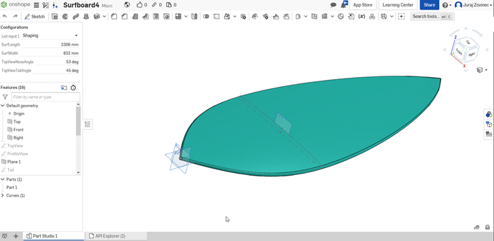

# SurfShaper !

## Purpose of SurfShaper application?
Main goal of this web appliciation is allow user to create and shape his own sufboard. After surfboard is shaped, board could be downloaded in stl format. After that shaped surfboard may be dispatched local CNC master who can made this surfboard of styrofoam.

## How does app work?
Application uses Onshape cloud based `CAD software`, where parametric model is configured. After user confirms changes, model is exported to GLTF format from `Onshape` and rendered on the website with `three js`.

## What about frontend ? 
Frontend of this application is based on Reactjs framework. 3D world is mostly built on react-three-fiber library from Paul Henschell. User can compare and configure three models at the same time.

### Lifecycle of frontend
* Web pages loads -> 
* API request are sent to OnShape in order to retrieve current model and its configuration parameters ->
* After user confirm new configuration parameters, new parameters are send to onShape CAD, where geometry of surf is recalculated ->
* New recalculated geometry is then sent back to surfshape app and is rendered.

## Fine then, how far we are?
Demo version of the application has been deployed to https://surf-shaper.herokuapp.com/
Since 3D model of surf requires more driving parameters, model is scaled to purpose of 3D printing. Surf could be downloaded in STL format and loadeded into 3D printer's slicer software.

## Sources might helped ?
* `Node.js Crash Course` by The Net Ninja https://youtu.be/zb3Qk8SG5Ms
* `Getting started Onshape API` by  Bill Schnoebelen  https://youtu.be/eFIMKjFxMes
* `Get started with React and Three.js using react three fiber` by Wrong Akram https://youtu.be/fdtqqyeKRJk
* `Animation and 3D in react-three-fiber` by Jason Lengstorf and Paul Henschel https://youtu.be/1rP3nNY2hTo
* `How to Deploy a Full Stack Web App to Heroku` by M. S. Farzan https://youtu.be/rUSjVri4I30

